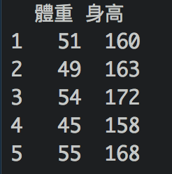

## 資料科學
如果還對什麼是資料科學有疑惑的話，可以聽聽[《科學月刊》林建宏：什麼是資料科學？](https://www.youtube.com/watch?v=yn6oCSnoAW4)。就不多花篇幅再定義了。

## R? Python? 
R跟Python是現在處理數據主流的程式語言，比較資深的資料科學家會說兩個語言各有千秋，要針對問題選用語言。對於剛剛想要開始學習資料科學的同學，面對的第一個挑戰是在R跟Python之間做個選擇。兩個語言都有強大的[開源社群](https://zh.wikipedia.org/wiki/开源软件)，這意昧著會有一大群熱情的軟體工作者｜資料科學家願意寫部落格，在論壇上打口水戰，激辯為什麼自己喜歡｜選擇的語言比較好。

我的看法是，若從零開始學習數據處理，選語言其實就像選朋友選工作一樣，你可以問自己：

- 我喜歡跟什麼樣的社群在一起？
- 我喜歡在什麼樣的社群工作？
- 我想解決的問題是什麼，而這個社群是不是跟我有一樣的煩惱｜興趣？
- 如果我有困難的話，這個社群是不是能給我幫助？

Python的社群是各種的軟體工程師，如果你上網找有關Python的教程的話，你會發現筆者常常會預先假設你有電腦科學背景，導致教程不一定好follow。Python比較多通用的資料處理｜資料科學[套件Package](http://breezymove.blogspot.com/2013/04/package.html)如pandas, scikit-learn, scipy, numpy。基本上做數據相關的工作，免不了用這幾個Package。最後，深度學習的社群一般比較傾向使用Python。

R是統計學者常用的語言，要是在Github做一點人肉搜索的話，你會發現很多R的開發者都是學者，不過近年來越來越多軟體工程師加入了R開發者的行列。R的Package通常能直接解決某個資料清理、[資料視覺化](https://zh.wikipedia.org/wiki/数据可视化)、[假設檢定](https://zh.wikipedia.org/wiki/假設檢定)、機器學習的問題，直至今日[CRAN](https://zh.wikipedia.org/wiki/R语言#CRAN)已經有12630個Package了，這個數字還不包含個人開發的Package。由於R的Package一般是為了解決一個具體的問題而設計的，他的社群結構比較緊密，只要去Github上就能迅速找到Package的作者以及主要使用者，並直接進行對話，一起討論解決問題。相比之下，Python的Package的社群會大很多，一般你比較難找到跟你最相近的開發者。這樣的社群架構是我偏好R的主要原因。

一般來說，如果你有電腦科學的背景的話，Python對你來說會比較直觀，畢竟他是一個通用程式語言，除了數據分析，Python也被用於其他軟體開發。但如果你完全沒有寫代碼的經驗，R畢竟是為了數據分析而出生的語言，我個人認為會比較好上手。

## 資料科學工作流程 - Data Science Workflow

注:圖中顯示的資料科學工作流大致跟Hadley在[R for Data Science](http://r4ds.had.co.nz/introduction.html)裡面所介紹的一樣，我把原圖翻成了中文，並且自己加了EDA和改進數據兩小點。

在學習資料科學常用的程式語言前，先了解基本的資料科學工作流程是很重要的。資料科學在報章雜誌中聽起來很酷炫，殊不知建預測模型只是整個工作流程的一部分，常常不是最花時間的。

### 讀取資料 - Import
常用R套件：[readr](https://github.com/tidyverse/readr), 
[jsonlite](https://github.com/jeroen/jsonlite)

首先，我們要先讀取數據，一般有兩種情況：

- 直接讀取現成的數據集(dataset)，常用的檔案有xls或csv
- 連接數據庫(database)後，寫[SQL](https://zh.wikipedia.org/wiki/SQL)讀取數據

這個課程中，我們先討論如何用R直接讀取現成的數據檔。你有點R的基礎後，就可以讀取你現有的資料，做一些數據分析囉。如果你已經有寫SQL的經驗，或以後從事數據相關的工作，使用數據庫來獲取資料會是比較常見的工作流程。

### 清理資料 - Tidy 
常用R套件：[dplyr](https://github.com/tidyverse/dplyr), [lubridate](https://github.com/tidyverse/lubridate), 
[stringr](https://github.com/tidyverse/stringr),
[data.table](https://github.com/Rdatatable/data.table)

接下來，是清理數據。乾淨的數據有兩個大原則：

- 統一數據格式：如果某欄是日期的話，所有紀錄的日期格式都要是一樣的
- 每一行(row)都是一則紀錄，每一欄(column)都是紀錄的相關資訊：如下，每行都是一個女生的紀錄，兩欄各表示體重和身高。

### 變換資料 - Transform
常用R套件：[dplyr](https://github.com/tidyverse/dplyr), [lubridate](https://github.com/tidyverse/lubridate), 
[stringr](https://github.com/tidyverse/stringr),
[data.table](https://github.com/Rdatatable/data.table),
[reshape2](https://github.com/hadley/reshape),
[tidyr](https://github.com/tidyverse/tidyr)

有了乾淨的數據後，就可以發揮你的創意，變換資料囉。變換資料當然不是憑空創造，而是根據現有的資料進行變換，每個人變換同一組資料的結果常常大不相同。假設我有一組問卷調查資料，column中包含所有調查對象的生日，我可以從生日將所有對象再細分為七年級、八年級、九年級生，並將變換結果存為新的column。新的column可以方便我分組分析，看看七年級生的回答跟九年級生有什麼不一樣。變換資料又常常被稱為Feature Engineering即特徵工程。

### 視覺化/探索 Visualize/EDA
常用R套件：[ggplot2](https://github.com/tidyverse/ggplot2), [rCharts](https://github.com/ramnathv/rCharts), 
[dygraphs](https://github.com/rstudio/dygraphs),
[ggvis](https://github.com/rstudio/ggvis),
[plotly](https://github.com/ropensci/plotly)

資料視覺化並不是什麼新的概念，每天報紙新聞中常常就已經穿插基本的統計圖表，因為比起乾巴巴的數字，大多數人反而容易理解圖像化的資料。資料視覺化是資料科學中必要的一步，也是建模前最重要的步驟。在數據量龐大的現在，只是呆呆盯著數據集常常是看不出什麼的，而把龐大的數據轉化成圖像，能夠讓你了解數據中的規律、趨勢，甚至看到數據中暗藏的問題(視覺化常常能讓你發現資料清理原來還做得不夠徹底)。我個人非常喜歡有創意的資料視覺，如果你也跟我一樣，R已經有很多成熟的視覺化套件，方便各種資料視覺化的需求，你可以直接用R完成一個資料視覺化的報告，以漂亮格式輸出，甚至做成網站，非常方便。

在[原圖](http://r4ds.had.co.nz/introduction.html)的基礎上，我在這一步加了探索/Exploratory Data Analysis，簡稱EDA。除了視覺化以外，了解數據集中各欄目的概述統計量(summary statistics)也是很重要的，這個詞聽起來很厲害，其實就是平均值、最大值、最小值、中位數等數值。了解概述統計量，能夠讓你在沒有看過數據中所有紀錄的情況下，對各欄目的數值範圍有點概念。例如，沿用上面問卷調查的例子，若知道調查對象的平均年齡，及最大最小年齡，能夠迅速讓你了解調查對象的年齡範圍。當然也能發現潛在問題，若問券調查是養小孩一年要花你多少錢，結果調查對象平均年齡僅17歲，都還不太可能有小孩的人，怎麼回答養小孩要花多少錢呢？

### 建模 Model 
整理並對你的數據有了一定的了解後，才可以開始建模。模型(model)這個詞在不同領域有不同的意思，在資料科學中，即使用某數學模型(公式)去找尋你現有的數據中的結構，藉此預測未來。這個數學模型可以很簡單，也可以很複雜，那都是建模，都是資料科學。模型的複雜程度跟正確度不一定成正比，而一般建模的原則是，簡單的模型管用的話，那就不要硬用複雜的模型。現今非常多流行的詞彙其實都是泛指建模，或是指模型的一種類型，不要搞混這些詞彙，搞清楚再使用很重要。如機器學習指的是使用電腦模擬及實現人類建模的過程，也就是利用電腦的運算能力，加速及實現建模。再如深度學習，又稱為腦神經網路模型，只是模型的一種，不可用來泛指建模。

### 交流 Communicate
有了酷炫的圖表和數學模型，你必須要清楚解釋你到底幹嘛了，並且說服別人。不多花篇幅詳細解釋其中會碰到的困難，因為太多了。只能強調這一步非常重要，你可以花時間努力做出很厲害的模型，但是若你沒有能力說服別人(買你的模型)，那就不能算是成功。

### 改進數據 Improve Data Input
這是我自己加的步驟。沒有完美的資料科學project，因為你總是能用更好更多的數據來改善模型。在你完成了整個工作流程後，你可以反思整個工作流程，想想自己是不是能改善數據本身的質量，或者加入新的資料來源，藉以得到新的發現，進而建立更好的模型。

(第一課完)

##### 若對內容有疑問或者想糾錯，可以開個issue或者直接email給我。
