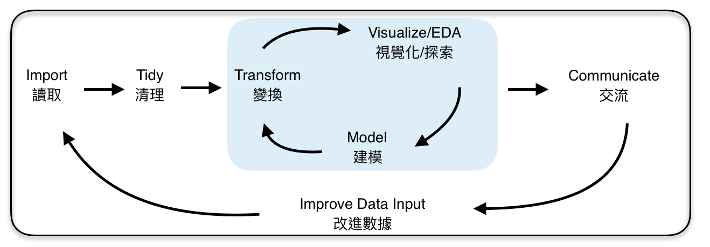

### 資料科學
如果還對什麼是資料科學有疑惑的話，可以聽聽[《科學月刊》林建宏：什麼是資料科學？](https://www.youtube.com/watch?v=yn6oCSnoAW4)。就不多花篇幅再定義了。

### R? Python? 
R跟Python是現在處理數據主流的程式語言，比較資深的資料科學家會說兩個語言各有千秋，要針對問題選用語言。對於剛剛想要開始學習資料科學的同學，面對的第一個挑戰是在R跟Python之間做個選擇。兩個語言都有強大的[開源社群](https://zh.wikipedia.org/wiki/开源软件)，這意昧著會有一大群熱情的軟體工作者｜資料科學家願意寫部落格，在論壇上打口水戰，激辯為什麼自己喜歡｜選擇的語言比較好。

我的看法是，若從零開始學習數據處理，選語言其實就像選朋友選工作一樣，你可以問自己：

- 我喜歡跟什麼樣的社群在一起？
- 我喜歡在什麼樣的社群工作？
- 我想解決的問題是什麼，而這個社群是不是跟我有一樣的煩惱｜興趣？
- 如果我有困難的話，這個社群是不是能給我幫助？

Python的社群是各種的軟體工程師，如果你上網找有關Python的教程的話，你會發現筆者常常會預先假設你有電腦科學背景，導致教程不一定好follow。Python比較多通用的資料處理｜資料科學[套件Package](http://breezymove.blogspot.com/2013/04/package.html)如pandas, scikit-learn, scipy, numpy。基本上做數據相關的工作，免不了用這幾個Package。最後，深度學習的社群一般比較傾向使用Python。

R是統計學者常用的語言，要是在Github做一點人肉搜索的話，你會發現很多R的開發者都是學者，不過近年來越來越多軟體工程師加入了R開發者的行列。R的Package通常能直接解決某個資料清理、[資料視覺化](https://zh.wikipedia.org/wiki/数据可视化)、[假設檢定](https://zh.wikipedia.org/wiki/假設檢定)、機器學習的問題，直至今日[CRAN](https://zh.wikipedia.org/wiki/R语言#CRAN)已經有12630個Package了，這個數字還不包含個人開發的Package。由於R的Package一般是為了解決一個具體的問題而設計的，他的社群結構比較緊密，只要去Github上就能迅速找到Package的作者以及主要使用者，並直接進行對話，一起討論解決問題。相比之下，Python的Package的社群會大很多，一般你比較難找到跟你最相近的開發者。這樣的社群架構是我偏好R的主要原因。

一般來說，如果你有電腦科學的背景的話，Python對你來說會比較直觀，畢竟他是一個通用程式語言，除了數據分析，Python也被用於其他軟體開發。但如果你完全沒有寫代碼的經驗，R畢竟是為了數據分析而出生的語言，我個人認為會比較好上手。

### 資料科學工作流程 - Data Science Workflow

注:圖中顯示的資料科學工作流大致跟Hadley在[R for Data Science](http://r4ds.had.co.nz/introduction.html)裡面所介紹的一樣，我把原圖翻成了中文，並且自己加了EDA和改進數據兩小點。

在學習資料科學常用的程式語言前，先了解基本的資料科學工作流程是很重要的。資料科學在報章雜誌中聽起來很酷炫，殊不知建預測模型只是整個工作的一小部分。

首先，我們要先讀取數據，一般有兩種情況：
- 直接讀取現成的數據集(dataset)，常用的檔案有xls或csv
- 連接數據庫(database)後，寫[SQL](https://zh.wikipedia.org/wiki/SQL)讀取數據

這個課程中，我們先討論如何用R直接讀取現成的數據檔。你有點R的基礎後，就可以讀取你現有的資料，做一些數據分析囉。如果你已經有寫SQL的經驗，或以後從事數據相關的工作，使用數據庫來獲取資料會是比較常見的工作流程。

接下來，是清理數據。乾淨的數據有兩個大原則：

- 統一數據格式：如果某欄是日期的話，所有紀錄的日期格式都要是一樣的
- 每一行(row)都是一則紀錄，每一欄(column)都是紀錄的相關資訊：如下，每行都是一個女生的紀錄，兩欄各表示體重和身高

```{r, echo = FALSE}
data.frame(體重 = c(51, 49, 54, 45, 55), 身高 = c(160, 163, 172, 158, 168))
```


### 如何選用一個Package?


